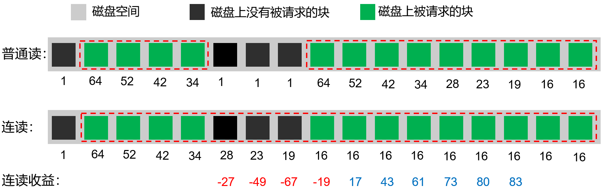
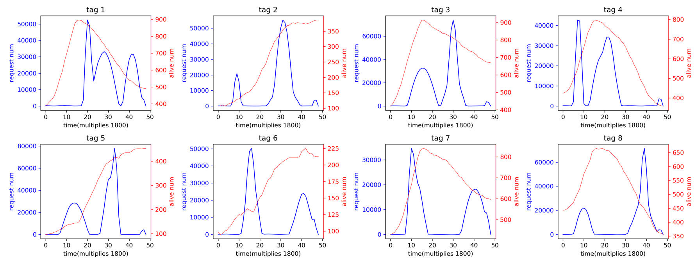
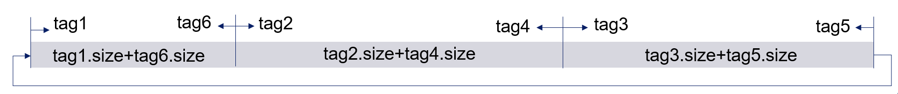

# 2025华为软挑策略整理
用数组表示磁盘，数组元素存储对象id和对象的块id，用空闲链表存储未分配的磁盘单元，用B+树存储存在请求的磁盘单元。

**读取策略**
--------

### 连读区域的搜索

每个时间步，如果磁盘该时间步令牌未用完，则从磁头位置开始搜索连续读区域。每次搜索固定数量的连读区域（或单元数）。

**连续读区域**表示一个连续区域内的磁盘单元要么都存在请求，要么能够通过冗余读减少总体的读取时间。通过冗余读减少总体时间花费示意图如下：

其判断算法如下：

（1）从接下来第一个存在读请求的位置开始，记录当前连读的单元数量

（2）如果遇见了不存在读请求的单元，则记录采用冗余读策略读取和直接PASS之间的差值，也即记录冗余读能比普通读节省多少时间，并分别记录两种策略的状态（如当前连读单元数量）

（3）对于之后每一步累积计算总节省时间，直到a或b情况出现：

a、节省时间为正数，这只可能在存在读请求处出现，表示冗余读开始有收益了。将累积差值置0，并跳到下一个不存在读请求的单元继续判断下一部分能否连接成连读区域，也即重复步骤（2）。,

b、当前连续出现不存在读请求的单元数超过k，这种情况可以确定这一段冗余读一定不会节省时间。这种情况下，回退到上一个不存在读请求的单元，将其之前的区域作为连读区域放入列表，并从回退位置开始，重复步骤（1）。

k值可以通过简单的预先计算得到，其值为10。计算方法为：冗余读的最好情况花费的令牌也比普通读最坏情况花费的令牌要多。

*   冗余读最好情况下，读每请求单元花费令牌数为16
*   普通读最坏情况下，走过k个不存在读请求的单元，再读后面存在读的单元，花费k+64+52+42+34+28+23+19+16+16+…，假设getReadConsume(n)是读后面n个存在读请求单元的花费，则简记为k+getReadConsume(n)

如果当前节省时间不为正数，且对所有n，16\*(k+n)≥k+getReadConsume(n)都成立，则表明不管后面有几个存在读的单元，冗余读节省的总时间都不可能为正，容易求得k为10。

### 磁盘读取的规划

对于每块磁盘，按磁盘上存在被请求单元的数量从大到小进行排序，按顺序规划。（经测试，这一顺序对策略效果影响不大）

对于每块磁盘，搜索完多个连读区域后，以连读区域为单元进行规划，计算每个连读区域累积的**读请求边缘价值**以及**读取花费令牌数**。

*   读请求边缘价值指，该区域内存在的所有请求的总分数的下降速度，即下个时间步，这个区域能获取的总分数会损失多少。
*   读取花费令牌数包括：磁头移动到该区域起始位置需要花费的令牌数，以及读取行为需要花费的令牌数。

分为两种情况处理：

（1）如果离磁头最近的连读区域也需要JUMP命令才能移动过去，则选择一个**读请求数/读取花费令牌数**最大的连读区域，跳到该区域的起始处进行连续读。

（2）如果最近的连读区域可以直接PASS过去，则将最近的连读区域作为优先区域，将后面的所有区域作为备选区域。对于每个备选区域，计算**先读备选区域再读优先区域的收益**和**先读优先区域再读备选区域的收益**，如果前者收益比后者大，则交换优先区域和备选区域，再进行下一个备选区域的判断，直到轮询完所有备选区域。

判断完毕后，将选择的连读区域放入磁头规划器，并计算每个块读完的时间，在存储对象类中更新对应块的状态为已规划，并记录完成时间。每当一个块被读完，就判断是否有请求被完成，如果完成，则提交请求，并将请求数组中存储的对应请求的指针置为指向一个deletedRequest的指针。

由于请求的分数随时间不是完全线性变化的，所以需要适时更新每个请求的**边缘价值**，这是利用请求数组中存储的请求顺序随时间单调递增，设置一个更新指针来完成的。请求的过期判断也采用同样的方法。

**存储策略**
--------

每个存储对象要求存储三个副本在不同磁盘上，且给出一个tag，相同tag对象的存取模式是类似的。对于每种tag，题目给出了其存储、读取、删除量随时间变化的统计数据。

### 存储的位置

一方面希望同一时间读取压力分摊在多个磁盘上，进行负载均衡；另一方面由于采取了连读策略，希望相同读取模式的对象存储位置靠近，以便通过冗余读节省时间。

在第一个考虑上，简单地为每种tag在每个磁盘上预分配空间，每个tag分配空间的大小依赖于题目给出的不同tag存储数据的相对比例。

在第二个考虑上，把tag的读取量随时间变化的序列作为向量，计算每种tag之间的相关系数。有两个用途：

（1）把两个相关系数大的tag分为一组，然后在磁盘上选取一个存储位置，从这个位置开始向两侧方向存储分别存储这一对tag的存储对象，保证相关性大的tag存储位置能比较靠近。

（2）由于预分配空间可能不够用，在属于某个tag的磁盘空间分配满后，将这一tag的对象分配到与其相关性最大的tag的磁盘空间上。如果这一空间也满了，则顺序找第二大相关性的磁盘空间，以此类推。

### 磁盘的选择

当新到达一个存储对象时，选择三个负载最小的磁盘来存储该对象。磁盘负载的计算方法：将磁盘上已存储的属于每个tag的单元分别乘该单元所属tag在接下来所有时间片被读取的次数累加和。这样可以较好地应对单元被删除导致某一个磁盘负载变小的情况。

**拒绝请求策略**
----------

如果存在请求未完成或过期，会扣除分数，请求拒绝得越早，分数扣除越少。在请求高峰时，大量请求无法完成导致过期扣除大量分数，所以需要设计提前拒绝请求的策略。

该策略以tag为粒度进行，相对简单，效果也不好，不具体说明。

教训
--

最开始时，我的关注点是，如果对象的不同块间累积了不同数量的请求（有的块已经被读取过了，有的块还没被读取，这时又来了一个对该对象所有块的请求，就会形成同一对象上不同块间累积的请求数量不同的情况），该如何规划选择特定块以尽快完成尽可能多的请求。因为某个请求只要有一个块还未被完成，这个请求就无法结算分数，且分数会随时间降低，形成短板效应。当时只把连读当成事后的小幅度优化手段。这一关注点粒度太细，复杂，且我没法很好地解决，做出来效果很差。之后队伍中另一成员编写了一个精简的状态策略，通过连续读实现了很好的效果，于是我才转换了思路，以连读作为重点。**教训是：先做简单的测试例子再确定方向，以及先尝试能够确定可行且有作用的方法再考虑复杂化。**

此外，正式赛时程序没有成功运行，部分也源于我对模块化、复用、封装这些概念的理解。在程序多处需要将大量令牌数转化为时间步数量+令牌余数、或者要将时间步转化为令牌数时，我都是直接除或者乘以每个时间步的令牌数（因为练习赛每个时间步的令牌数是固定的），但是令牌数改为随时间步变化时，我才意识到，这里**应该有一个意义明确的转换函数，而不是一个添在语句后面的计算公式。**

此外，设计算法时，有时会发觉设计的函数需要满足一定的调用顺序才能正确工作，而这个调用顺序是难以直观地自然地察觉到的。考虑如何应对这种情况让语义清晰。

**补充**
------

commit记录中的Eleanor是我在linux上提交记录时的用户名。
